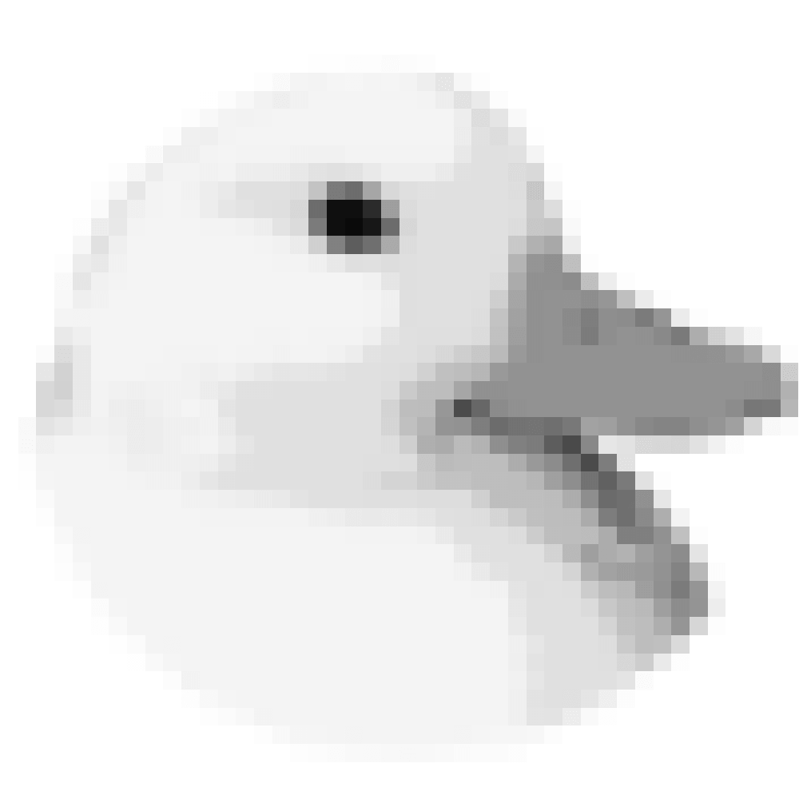
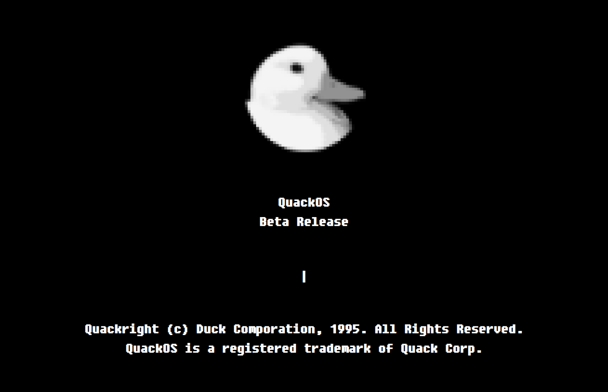
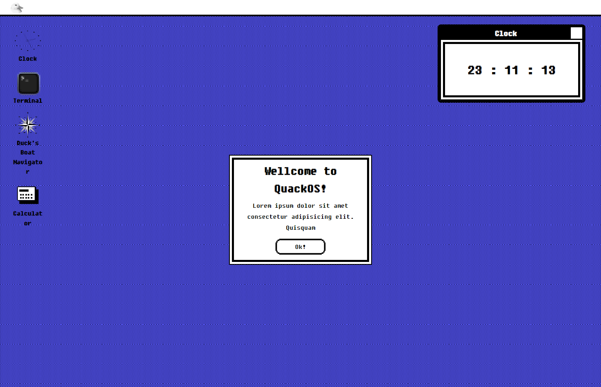
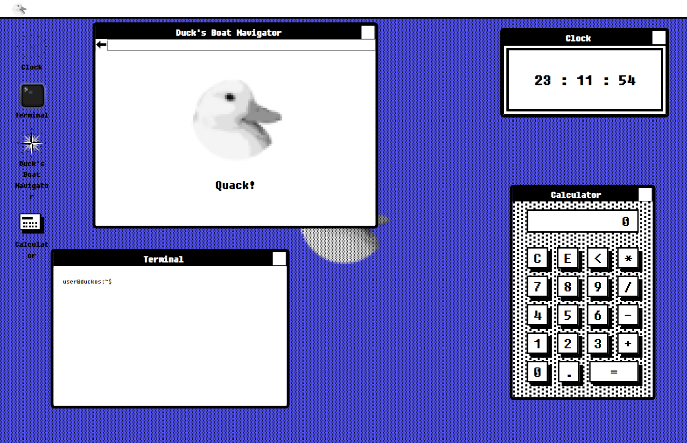

  
  <h1>🦆 QuackOS - A (fake) web-based OS</h1>

  
  
  
  

QuackOS is a web-based OS that I made for fun. It's (obviously) a fake OS, so it doesn't have any real functionality.

You can check it out [here](https://quack.jnaraujo.com/).

> **Note:** This project is still in development, so it's not ready for production yet.

## 🙏 Screenshots

  
  
  

## 💻 Tech Stack

- [React](https://reactjs.org/)
- [Vite](https://vitejs.dev/)
- [TypeScript](https://www.typescriptlang.org/)
- [Styled Components](https://styled-components.com/)

## 🙏 Thanks

### Figma design

- [macOS Classic](https://www.figma.com/community/file/907684770824957775)
- [1985 Windows 1.0 Beta UI Kit](https://www.figma.com/community/file/818237089756436977)

### Fonts

- [Fixedsys Excelsior](https://github.com/kika/fixedsys)
